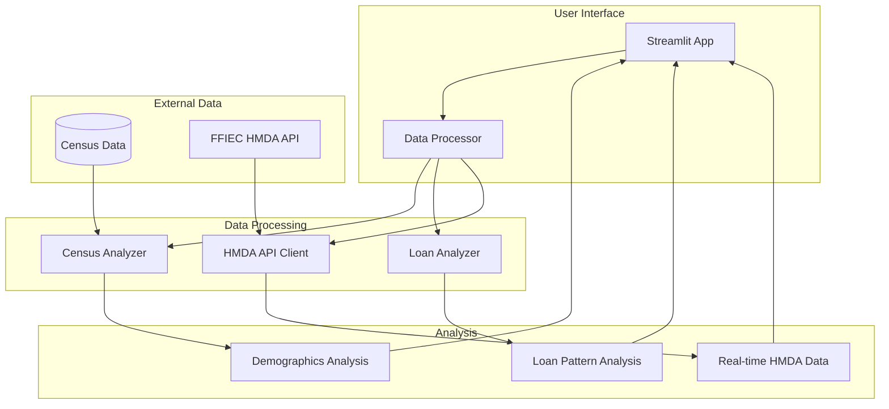

# HMDA Multi-Agent System

A multi-agent system for analyzing Home Mortgage Disclosure Act (HMDA) data and providing loan qualification assistance.

## Overview

This project uses a Streamlit-based interface to analyze HMDA (Home Mortgage Disclosure Act) data, integrating census information and loan data to provide insights into lending patterns and market analysis.

## System Architecture



## Project Structure

```
.
├── src/                   # Source code
│   ├── app.py            # Streamlit application
│   ├── utils/            # Utility modules
│   │   ├── census_analyzer.py    # Census data analysis
│   │   ├── data_processor.py     # Data processing
│   │   ├── hmda_api.py          # HMDA API client
│   │   └── loan_analyzer.py      # Loan analysis
│   └── pages/            # Streamlit pages
├── data/                 # Data files
│   ├── cache/           # Cached API responses
│   └── CensusFlatFile2024.csv  # Census data file
├── docker/              # Docker configuration
└── tests/              # Test suites
```

## Data Sources

- HMDA Data: Retrieved from FFIEC API (https://ffiec.cfpb.gov/v2/data-browser-api/view/csv)
- Census Data: Local integration of census flat files (CensusFlatFile2024.csv)
- MSA/Regional Data: FFIEC census and demographic information

## Requirements

- Python 3.11+
- Required Python packages (see requirements.txt)

## Installation

1. Create and activate a virtual environment:
```bash
python -m venv venv
source venv/bin/activate  # On Windows: .\venv\Scripts\activate
```

2. Install Python dependencies:
```bash
pip install -r requirements.txt
```

3. Configure environment variables:
```bash
cp .env.example .env
# Edit .env with your configuration
```

4. Download the required census data file:
- Download the FFIEC Census flat file
- Save it as `data/CensusFlatFile2024.csv`

## Running the Application

Start the Streamlit app:
```bash
streamlit run src/app.py
```

The application will be available at http://localhost:8501

## Docker Deployment

Build and run using Docker:
```bash
docker-compose up --build
```

## Features

- Census data analysis
- HMDA loan pattern analysis
- Market assessment tools
- Demographic insights
- Real-time HMDA data integration

## Contributing

1. Fork the repository
2. Create a feature branch
3. Commit your changes
4. Push to the branch
5. Create a Pull Request

## License

This project is licensed under the MIT License - see the [LICENSE](LICENSE) file for details.

## Acknowledgments

- FFIEC for providing the HMDA data
- Census Bureau for demographic data
- All contributors and researchers using this tool
